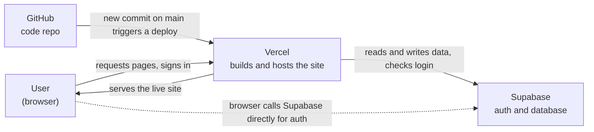

# Walking Skeleton

## 1. Where does your code live?

On GitHub, in the `nextjs-with-supabase` repo. The `main` branch is the source of truth. It is a Next.js app (App Router, Tailwind, shadcn/ui):

- `app/` holds the pages (home, `auth/*` login and sign-up flows, `protected/`)
- `components/` holds the UI pieces
- `lib/supabase/` holds the Supabase client setup
- `app/globals.css` holds the orange and green theme

## 2. Where does your data live, and what is stored there right now?

In a Supabase project. The app connects with two environment variables (see `.env.example`): the project URL and the publishable key.

Right now it holds:

- **A single test user** in Supabase Auth, signed up with email and password.
- **No confirmed app data.** The code includes a tutorial query against a `notes` table, but the repo has no migrations or schema files, so it is unclear whether that table exists or has rows. Check the Table Editor in Supabase to be sure.

## 3. How does a change get from Claude Code to the live site?

1. Ask Claude Code for a change (for example, "make the site orange and green").
2. Claude edits the files in its working copy of the repo.
3. Claude commits the change with a message.
4. Claude pushes the commit to GitHub (to a branch, or straight to `main` when told to).
5. Vercel is connected to the GitHub repo and sees the new commit on `main`.
6. Vercel builds the app.
7. If the build succeeds, Vercel promotes it to Production, usually within a minute.
8. The live site now shows the change. Reload to see it.

If a build fails, the deployment shows an error in Vercel and the live site keeps serving the last good version.

## 4. What will you need to add to turn this into your team's app?

This depends on the product manager's feature list, which is not in the repo yet. Once it is added, each feature gets mapped to the work below.

**Already in place**

- Email sign-up, login, logout and password reset
- A protected page that only signed-in users can open
- Light and dark theme, and the orange and green palette

**Likely needed regardless of the feature list**

- Database tables for the team's data, saved as migration files in the repo
- Row Level Security policies so each user only sees what they should
- Pages and forms for each feature on the PM's list
- Replacing the starter tutorial content on the home page and `protected/` with real content
- Roles or team membership, if different people need different access
- Environment variables set in Vercel for production
- A staging or preview flow, so changes are checked before they reach `main`

## 5. Diagram

Every change starts when Claude Code pushes code to GitHub.
